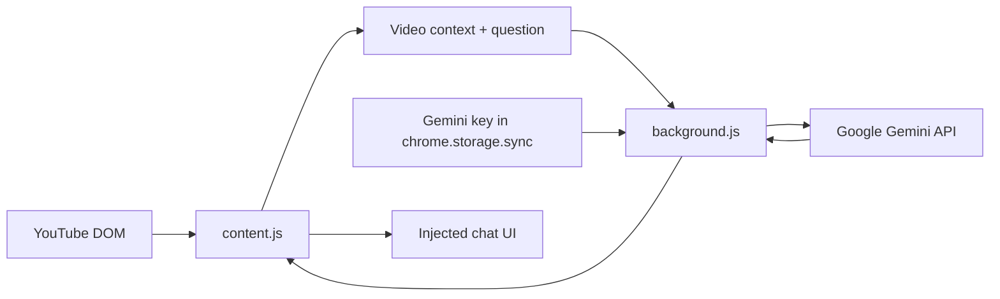

# YouTube Video Chat Assistant

> A Chromium extension that brings Gemini-powered questions and answers into YouTube watch, Shorts, and live-video pages.

[](https://www.supportkori.com/montasim)
[](https://github.com/montasim/youtube-helper/actions/workflows/publish.yml)

The extension gathers the current video’s visible metadata and transcript when available, injects a chat panel into YouTube, and sends the resulting context plus each question directly to Google’s Gemini 2.5 Flash API using the user’s own key.

**[Report an issue](https://github.com/montasim/youtube-helper/issues) · [Get a Gemini API key](https://aistudio.google.com/app/apikey)**

## Features

- Embedded chat on YouTube watch, Shorts, and live pages
- Video title, channel, description, duration, playback time, URL, and transcript context
- Gemini 2.5 Flash responses with the user’s own API key
- API-key validation from the extension popup
- Recent-video history for up to ten videos
- Single-page navigation detection when the current YouTube video changes
- Manifest V3 extension build and ZIP packaging commands

## Privacy at a glance

The Gemini key is stored with `chrome.storage.sync`, which can synchronize through the signed-in browser profile. Recent video history is stored in YouTube-origin `localStorage`. When you chat, video metadata, any extracted transcript, the video URL, current playback time, and your question are sent to Google’s Generative Language API. Review Google’s data terms before using confidential or private material.

This project does not operate an intermediary backend.

## Install from source

### Requirements

- Node.js 20.19.3 (see `.node-version`)
- npm (the repository commits `package-lock.json`)
- Chrome or another Chromium browser
- A Gemini API key with Generative Language API access

Although `package.json` declares pnpm 10+, the scripts call `npm` internally and only `package-lock.json` is committed. The documented development path therefore uses npm.

### Build and load

```bash
git clone https://github.com/montasim/youtube-helper.git
cd youtube-helper
npm install
npm run build:extension
```

1. Open `chrome://extensions`.
2. Enable **Developer mode**.
3. Select **Load unpacked**.
4. Choose `extension-dist/`.
5. Open the extension popup, enter your Gemini key, and save it.
6. Visit a supported YouTube video page and open the injected chat.

For a distributable archive, run `npm run package:extension`; it creates `youtube-video-chat-extension.zip`.

## How it works



`content.js` observes YouTube’s dynamic page, extracts context, maintains recent history, and renders chat. `background.js` owns Gemini requests. `popup.js` stores and optionally validates the API key.

## Gemini request behavior

| Setting | Value |
| --- | --- |
| Endpoint | Generative Language API `v1beta` |
| Model | `gemini-2.5-flash` |
| Chat temperature | `0.7` |
| Top K / Top P | `40` / `0.95` |
| Maximum output tokens | `1024` |

Model availability, quotas, pricing, and API behavior are controlled by Google and may change independently of this extension.

## Permissions

| Permission/scope | Purpose |
| --- | --- |
| `activeTab` | Interact with the current supported YouTube tab |
| `storage` | Store the Gemini API key in browser sync storage |
| YouTube host access | Inject the chat and read page/video context |
| Google Generative Language host access | Validate the key and send chat requests |

## Commands

| Command | Purpose |
| --- | --- |
| `npm run build:extension` | Copy extension assets into `extension-dist/` |
| `npm run package:extension` | Build and ZIP the extension |
| `npm run dev:extension` | Build and print unpacked-install guidance |
| `npm run build` | Build the small TypeScript package entry into `dist/` |
| `npm test` | Run Jest |
| `npm run lint:check` | Check ESLint and Prettier |

The TypeScript package entry currently exports only a boilerplate welcome function and is not the runtime extension implementation.

## Important limitations

- Transcript extraction depends on YouTube’s current DOM and transcript availability; disabled captions, language differences, or markup changes can prevent it.
- The extension sends the complete extracted transcript in one prompt and does not chunk long videos, so model input limits may truncate or reject requests.
- AI answers can be incomplete or inaccurate; confirm important claims against the video or primary sources.
- Browser sync storage is convenient, not a dedicated secrets vault. Restrict and rotate exposed API keys.
- Only Chromium installation is documented and the extension is not linked to a browser-store listing.
- The repository has license metadata and a Creative Commons statement but no `LICENSE` file containing the license text.
- The publish workflow runs formatting fixes, versions/tags, and npm publishing on every push to `main`; maintainers should review that release design before enabling it with credentials.

## Troubleshooting

- **No chat button:** confirm the URL is a watch, Shorts, or live page, then reload the extension and tab.
- **No transcript:** open a video with captions and retry; extraction cannot manufacture a transcript.
- **API failure:** validate the key in the popup and check Google quota, permissions, network access, and browser console logs.
- **Old context after navigation:** refresh the page and report the source and destination video URLs if it reproduces.

## Contributing and security

Run `npm run lint:check`, `npm test`, and `npm run build:extension` before a pull request. Do not commit API keys or include them in screenshots/logs. Follow [SECURITY.md](SECURITY.md) for private vulnerability reporting.

## Funding

Support continued development through [SupportKori](https://www.supportkori.com/montasim).

## License

The project metadata declares [CC BY-NC-ND 4.0](https://creativecommons.org/licenses/by-nc-nd/4.0/), which permits sharing with attribution but prohibits commercial use and distribution of derivatives. A local license file is currently missing; add one before relying on the repository as the authoritative license grant.

## Author

Created by [Montasim](https://github.com/montasim).
