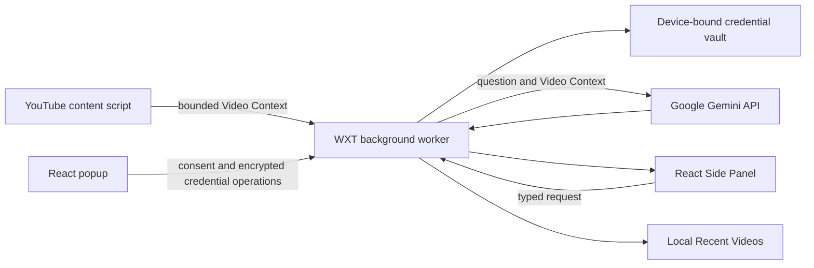

# VidQuery

> Ask Gemini questions grounded in the YouTube video you are watching, from a focused Chrome Side Panel.

[](https://github.com/montasim/VidQuery/actions/workflows/ci.yml)
[](https://www.supportkori.com/montasim)

VidQuery is a Chromium extension for people who want to question a video without moving its transcript and metadata into a separate chat tool. Open a YouTube watch, Shorts, or live-video page; the extension collects a bounded Video Context locally and sends it directly to Google Gemini only after you submit a question.

The V2 extension uses a Chrome Side Panel for conversations and a compact toolbar popup for consent and Gemini connection setup. It has no intermediary backend, account, analytics service, or persistent conversation archive.

**[Browse releases](https://github.com/montasim/VidQuery/releases) · [Preview the approved interface](prototypes/extension/v1.html) · [Report an issue](https://github.com/montasim/VidQuery/issues)**

## What it does

- Opens a dedicated conversation workspace in Chrome’s Side Panel.
- Adds an **Ask this video** launcher to supported YouTube pages.
- Grounds questions in the current video title, channel, full description and links, URL, duration, playback position, available transcript, comments, and replies.
- Supports YouTube watch, Shorts, and live-video routes, including single-page navigation between videos.
- Shows whether transcript context is available before a question is sent.
- Renders structured Gemini answers, including lists, links, and code.
- Lets a person edit and resend a question or retry a failed answer.
- Retains up to ten Recent Videos for navigation without saving their transcripts or conversations.
- Keeps the Gemini key in a device-bound encrypted credential vault.
- Migrates the legacy synced key and YouTube-origin recent-video list when safe to do so.

## Install from a GitHub Release

Once a release has been published by the tag workflow:

1. Open [GitHub Releases](https://github.com/montasim/VidQuery/releases).
2. Download `VidQuery-vX.Y.Z-chrome-unpacked.zip` and `SHA256SUMS.txt`.
3. Place both files in the same folder and verify the download:

    ```bash
    sha256sum --check SHA256SUMS.txt
    ```

4. Extract the ZIP to a permanent folder.
5. Open `chrome://extensions`, enable **Developer mode**, and select **Load unpacked**.
6. Choose the extracted folder containing `manifest.json`.

GitHub-installed builds do not update automatically. Repeat this process for each newer release, and keep the extracted folder in place while Chrome uses the extension.

## Install from source

### Requirements

- Node.js 20.19.3 or newer
- pnpm 10.10.0 or compatible
- Chrome 141 or newer, required for the in-panel close control
- A Gemini API key from [Google AI Studio](https://aistudio.google.com/app/apikey)

### Build and load

```bash
git clone https://github.com/montasim/VidQuery.git
cd VidQuery
pnpm install
pnpm build:extension
```

1. Open `chrome://extensions`.
2. Enable **Developer mode**.
3. Select **Load unpacked**.
4. Choose `apps/extension/.output/` from this repository.
5. Pin VidQuery to the browser toolbar if desired.

For an installable archive, run `pnpm release:zip`; WXT writes the packaged extension under `apps/extension/.output/`.

## First use

1. Select the VidQuery toolbar icon.
2. Paste your Gemini API key.
3. Read and confirm the AI-processing disclosure.
4. Select **Save and validate**. **Save without validation** is available when validation cannot be completed, but the first real question may still fail if the key or model access is invalid.
5. Open a supported YouTube video.
6. Select the floating **Ask this video** button, or reopen the popup and select **Open assistant**.
7. Ask a question in the Side Panel.

Nothing is sent to Gemini merely because the panel is open. The Video Context and question are sent only when the person asks.

## Privacy and credential storage

The Gemini key is encrypted with AES-GCM before persistent storage. A non-exportable, device-bound encryption key is kept in IndexedDB; `chrome.storage.local` receives only versioned ciphertext and an initialization vector. Decrypted credentials are cached in `chrome.storage.session` for the active browser session, and both storage areas are restricted to trusted extension contexts.

This design protects the key from casual plaintext inspection and from direct content-script access. It is not an operating-system credential manager and cannot protect a key from a malicious or compromised extension process. Remove or rotate the key if the browser profile or device may be compromised.

When a question is submitted, the following can be sent directly to Google’s Gemini API:

- video title and channel;
- description and URL;
- duration and current playback position;
- available transcript text;
- loaded comments and replies; and
- the person’s question.

No project-operated backend receives this data. Google controls Gemini availability, quotas, retention, and data handling. Google states that free-tier content may be used to improve its products; review the [Gemini API pricing and data-use table](https://ai.google.dev/gemini-api/docs/pricing) and [Gemini API terms](https://ai.google.dev/gemini-api/terms) before sending sensitive material.

## Architecture



| Area                     | Implementation                                               |
| ------------------------ | ------------------------------------------------------------ |
| Extension framework      | WXT with Manifest V3                                         |
| Interface                | React 19, Tailwind CSS 4, shadcn-compatible Radix primitives |
| Language and validation  | TypeScript and Zod                                           |
| AI provider              | Gemini Developer API, direct BYOK access                     |
| Persistent state         | Restricted `chrome.storage.local`                            |
| Session credential cache | Restricted `chrome.storage.session`                          |
| Device encryption key    | Non-exportable Web Crypto key in IndexedDB                   |
| Tests                    | Vitest, Testing Library, Happy DOM, fake-indexeddb           |
| Product website          | TanStack Start, shadcn, Tailwind CSS 4, Netlify              |

The project’s domain language is in [CONTEXT.md](CONTEXT.md). Architectural trade-offs are recorded under [docs/adr](docs/adr).

## Development

```bash
pnpm install
pnpm dev:extension
```

WXT prints the development output path. Load that unpacked directory in Chrome, keep a YouTube video open, and reload the extension after permission or manifest changes.

| Command                | Purpose                                                 |
| ---------------------- | ------------------------------------------------------- |
| `pnpm dev:extension`   | Start WXT extension development                         |
| `pnpm dev:web`         | Start the TanStack Start landing page                   |
| `pnpm build:extension` | Build the Chrome Manifest V3 extension                  |
| `pnpm build:web`       | Build the Netlify-ready website                         |
| `pnpm release:zip`     | Validate and package the extension                      |
| `pnpm check:extension` | Run extension formatting, lint, types, tests, and build |
| `pnpm check:web`       | Run website formatting, lint, types, and Netlify build  |
| `pnpm check`           | Run the complete workspace quality gate                 |

## Project structure

```text
apps/extension/          WXT extension source, tests, and package configuration
apps/web/                TanStack Start, shadcn, Tailwind, and Netlify website
assets/brand/            Canonical VidQuery brand assets
prototypes/extension/v1.html Standalone approved extension interface reference
prototypes/web/v1.html       Original static landing-page reference
docs/adr/                Accepted architecture decisions
```

## Current limitations

- Description, transcript, comment, and reply extraction depends on YouTube’s current rendered controls and markup. VidQuery loads a bounded set of comments and replies when possible; disabled comments, unavailable captions, or future YouTube DOM changes can leave some sources unavailable.
- The complete extracted transcript is sent in one Gemini request. Very long transcripts may exceed provider limits.
- Gemini responses can be incomplete or inaccurate. Verify important claims against the video and primary sources.
- Free-tier availability, model access, quotas, and data use are controlled by Google and may change independently of this extension.
- Conversations exist only in the active Side Panel document and are intentionally not restored after that session closes.
- Only Chromium installation is documented. There is no verified Chrome Web Store listing in this repository.
- The repository has no `LICENSE` file. Source visibility does not grant permission to copy, modify, or redistribute it.

## Automated releases

Pushing a version tag such as `v2.0.0` runs the [Release workflow](.github/workflows/release.yml). The tag must match `apps/extension/package.json`. The workflow installs the locked dependency graph, runs the complete quality gate, builds the WXT archive, verifies that `manifest.json` is at its root, generates SHA-256 checksums, and creates a GitHub Release with versioned and stable download filenames.

Release descriptions come from [.github/RELEASE_NOTES.md](.github/RELEASE_NOTES.md) and should be updated before tagging. See [DEPLOYMENT.md](DEPLOYMENT.md) for the maintainer checklist and exact release procedure. The repository does not publish this extension to npm or submit it automatically to the Chrome Web Store.

## Support and security

Use [GitHub Issues](https://github.com/montasim/VidQuery/issues) for reproducible bugs and feature requests. Include the browser version, YouTube route type, whether a transcript was available, and the visible error message. Never include an API key, transcript, private question, or full Gemini request in an issue.

Report vulnerabilities privately using [SECURITY.md](SECURITY.md).

## Contributing

Issues and pull requests are welcome. Keep changes aligned with the accepted ADRs and immutable prototype workflow. Run `pnpm check` before opening a pull request, and do not include build output, browser-profile data, API keys, or captured private transcripts.

## Funding

Optional support helps maintain compatibility with YouTube and Gemini changes: [support the project on SupportKori](https://www.supportkori.com/montasim). Bug reports, tests, and documentation improvements are equally useful.

## Author

Built and maintained by [Montasim](https://github.com/montasim).

## License status

No license text is currently included. Until a `LICENSE` file is added, no open-source license grant should be inferred from package metadata or earlier releases.
